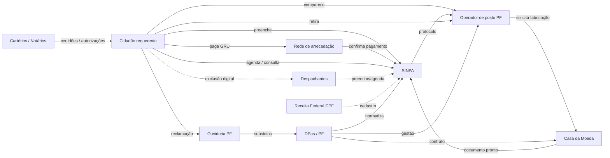

# Mapa de Atores — Obter Passaporte Comum (Polícia Federal)

**Serviço:** Obter passaporte comum para brasileiro · **Canais:** web (Gov.br/SINPA) + presencial (postos PF)  
**Propósito do mapa** *(decisão Rodada 1, transcript):* reduzir **demanda falha** — recontato por compensação de GRU, exclusão digital empurrando a despachantes, e reinício por cancelamento em 90 dias.  
**Metodologia:** Aula 02 — Passos 0–5; destilação via `/grill-me` (`C_grill_transcript.md`).

---

## Diagrama de fluxo (relações — Passo 4)

---

## Tabela RACI — 10 atores (Passo 5)

Legenda: **R** = Responsável · **A** = Aprovador · **C** = Consultado · **I** = Informado · **—** = não aplicável

| # | Ator | Categoria | R | A | C | I | Entra na jornada | Sai da jornada |
| --- | --- | --- | --- | --- | --- | --- | --- | --- |
| 1 | **Cidadão requerente** | Demandante | Iniciar solicitação; pagar GRU; comparecer; retirar documento | — | — | Status do protocolo | t=0 (acesso Gov.br/SINPA) | Retirada do passaporte ou desistência/cancelamento |
| 2 | **Sistema SINPA** | Sistema de atendimento | Processar formulário; validar GRU paga; liberar agendamento; consulta de andamento | — | — | — | t=0+ (redirecionamento do Gov.br) | Baixa do protocolo na entrega ou cancelamento (ex.: 90 dias) |
| 3 | **Rede de arrecadação (PagTesouro / Bancos / SIAR-PF)** | Sistema financeiro | Emitir/compensar GRU; transmitir retorno bancário ao SIAR | — | — | — | Após formulário (geração GRU) | Confirmação de pagamento registrada no SINPA |
| 4 | **Operador de posto PF** (policial + apoio terceirizado) | Operador linha de frente | Triagem documental; coleta biométrica; entrega do livrete | — | DPas | SINPA; RFB (dados) | Dia do agendamento presencial | Entrega do passaporte ou recusa documental |
| 5 | **Casa da Moeda do Brasil (CMB)** | Fornecedor / fabricação | Produzir caderneta e chip; entregar à PF | DPas | — | — | Após aprovação biométrica no posto | Documento disponível para retirada |
| 6 | **Despachantes e assessorias** | Intermediário | Preencher formulário; monitorar vagas (serviço pago) | — | — | Cidadão | Quando cidadão terceiriza etapas web | Entrega do agendamento ou fim do contrato privado |
| 7 | **Ouvidoria da Polícia Federal** | Controle social | Registrar manifestações; encaminhar à gestão | — | — | Cidadão | Após fricção (GRU, agendamento, posto) | Resposta ou arquivamento da manifestação |
| 8 | **Receita Federal (base CPF)** | Órgão cadastral | Manter cadastro CPF | — | — | SINPA; Operador de posto | Validação cadastral (etapas web/presencial) | Consistência verificada ou pendência sanada |
| 9 | **Cartórios e notários** | Cadeia documental | Emitir certidões; reconhecer firmas; autorizações de menores | — | CNJ (normativo) | Cidadão; Operador de posto | Pré-requisito documental (antes/durante posto) | Documentação aceita na triagem |
| 10 | **Divisão de Passaportes — DPas/PF** | Gestor / decisor | Normatizar fluxo; monitorar serviço; contratar CMB | — | DG/PF | Ouvidoria; Operadores | Governança contínua | — (ator permanente na retaguarda) |

---

## Matriz de Mendelow — atores-chave (Passo 2, análise do autor)

| Ator | Poder | Interesse | Quadrante | Fricção / failure demand associada |
| --- | --- | --- | --- | --- |
| DPas/PF | Alto | Alto | Key player | Orçamento vs. volume de demanda |
| SINPA | Alto | Alto | Key player | Digital-only; sem fila de espera no agendamento |
| CMB | Alto | Alto | Key player | Atraso fabricação → consultas repetidas |
| Rede de arrecadação | Médio | Baixo | Manter informado | Janela compensação GRU → agendamento prematuro |
| Cidadão requerente | Baixo | Alto | Manter informado | Exclusão digital; perda taxa 90 dias |
| Operador de posto PF | Baixo | Alto | Manter informado | Absorve falhas dos sistemas centrais |
| Despachantes | Baixo | Alto | Monitorar | Beneficiam-se da complexidade do SINPA |
| Ouvidoria PF | Médio | Médio | Manter satisfeito | Intelligence sobre failure demand |
| Receita Federal | Alto | Baixo | Manter satisfeito | Divergência cadastral (pendente na v3) |
| Cartórios/notários | Alto | Baixo | Manter satisfeito | Fricção estrutural em menores |

---

## Hipóteses sobre incentivos (Passo 3)

| Ator | Ganha com serviço “quebrado”? | Resistência à simplificação |
| --- | --- | --- |
| Despachantes | Sim — cobram por formulário gratuito | Alta |
| DPas/PF | Não diretamente; pressão por metas Gov.br | Média (segurança + orçamento) |
| CMB | Volume de produção | Baixa para simplificar UX; média se cortar empenho |
| Operador de posto | Não; sobrecarga por failure demand | Baixa — favorece sistemas estáveis |
| SINPA (via contratos TI) | Manutenção reativa gera demanda | Média (legado) |

---

## Atores-chave para ação (Passo 5 — 5 a 8 atores)

Prioridade de engajamento para reduzir failure demand *(decisões Rodadas 1, 5, 8, 10)*:

1. **SINPA / DPas** — visibilidade de status da GRU e fila de agendamento  
2. **Rede de arrecadação** — integração tempo real pós-Pix  
3. **Cidadão requerente** — testes com analfabetos digitais  
4. **Despachantes** — medir dependência como indicador de UX  
5. **Ouvidoria PF** — taxonomy de reclamações GRU/agendamento  
6. **Operador de posto PF** — protocolo unificado de retificação no guichê  
7. **CMB** — alerta proativo antes dos 90 dias de cancelamento  

---

## Consistência com o transcript

Todos os atores das linhas 1–10 da tabela RACI aparecem nominalmente em `C_grill_transcript.md` (Rodadas 2–10).
